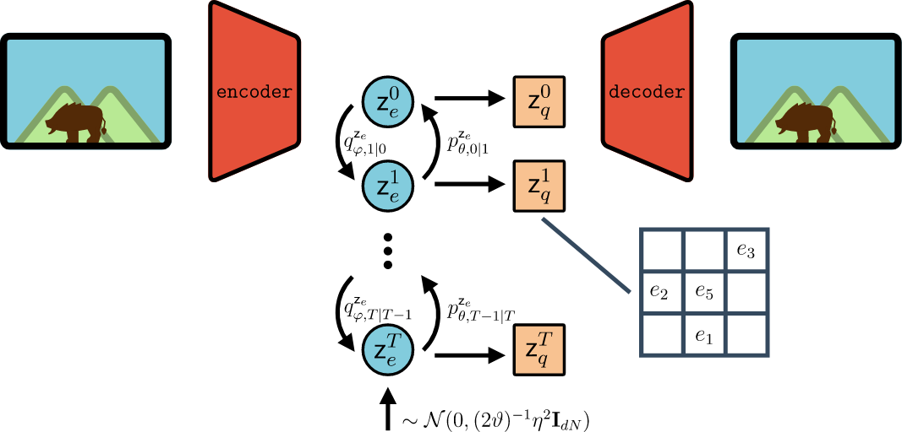
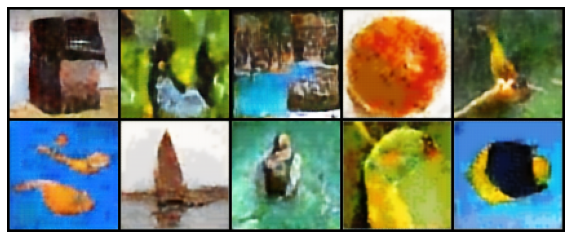
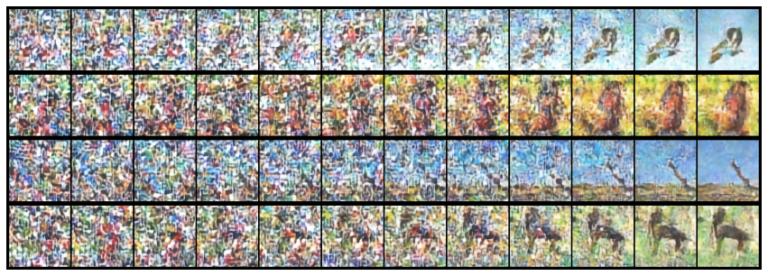
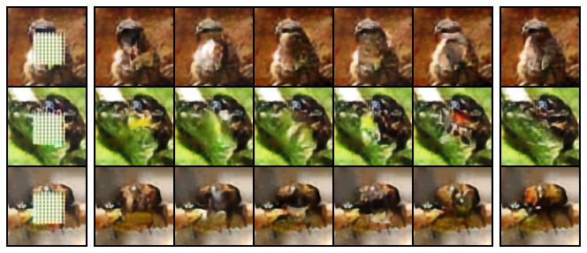

# Diffusion Bridges Vector Quantized Variational Autoencoders

A diffusion probabilistic model framework, that enables Vector Quantized latent space models. This repo includes an implementation of a DDPM prior trained on the `CIFAR10` and `mini-imagenet` datasets.



## Structure of the repo

 - **ddpm**: implementation of the `ddpm` framework, which only depends on `torch`
 - **docs**: documentation of the `ddpm` framework, using sphinx. Requirements can be found in `docs/requirements.txt`.
 - **mixturevqvae**: implementation of various modules used in the paper. Required libraries are found in `requirements.txt`.
 - **scripts**: definition of scripts, using the `mixturevqvae` modules, for the paper experiments.

## Usage
We define a generic Gaussian DDPM, which can be used to implement models such as Ho [1]:

```python
import torch
from ddpm.diffusion_bridge import DiffusionBridge


class HoDiffusion(DiffusionBridge):
    """DDPM as defined in Ho https://arxiv.org/pdf/2006.11239.pdf."""

    theta = 1
    eta2 = 2
    diffusion_target = 0

    def __init__(
        self,
        denoising_model: callable,
        delta_schedule: torch.Tensor,
        num_steps: int,
    ):
        super().__init__(
            denoising_model=denoising_model,
            delta_schedule=delta_schedule,
            num_steps=num_steps,
            theta=self.theta,
            eta2=self.eta2,
            diffusion_target=self.diffusion_target,
        )
```

## Run the experiments from the paper
The experiments from the papers are defined in the `scripts/` folder. For instance, in order to train a Gaussian DDPM on cifar, run:
```bash
python -m scripts.ho.cifar --gpus 1 --epochs 2
```

Here are a few samples from our trained model:





## Cite
```
@InProceedings{pmlr-v162-cohen22b,
  title = 	 {Diffusion bridges vector quantized variational autoencoders},
  author =       {Cohen, Max and Quispe, Guillaume and Corff, Sylvain Le and Ollion, Charles and Moulines, Eric},
  booktitle = 	 {Proceedings of the 39th International Conference on Machine Learning},
  pages = 	 {4141--4156},
  year = 	 {2022},
  editor = 	 {Chaudhuri, Kamalika and Jegelka, Stefanie and Song, Le and Szepesvari, Csaba and Niu, Gang and Sabato, Sivan},
  volume = 	 {162},
  series = 	 {Proceedings of Machine Learning Research},
  month = 	 {17--23 Jul},
  publisher =    {PMLR},
  pdf = 	 {https://proceedings.mlr.press/v162/cohen22b/cohen22b.pdf},
  url = 	 {https://proceedings.mlr.press/v162/cohen22b.html},
}
```

[1] Ho, Jonathan et al. “Denoising Diffusion Probabilistic Models.” ArXiv abs/2006.11239 (2020): n. pag.
